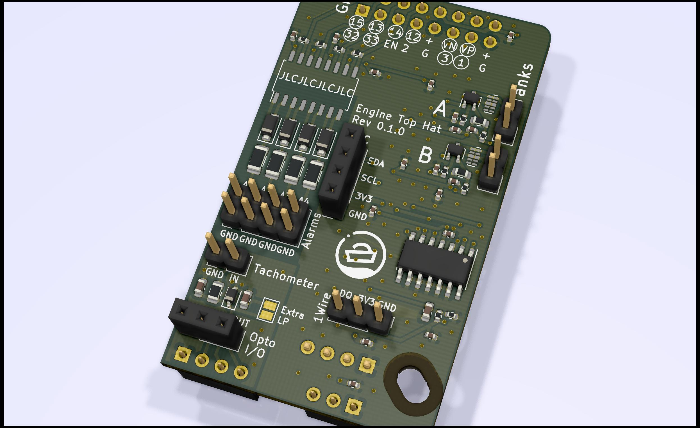

# Engine Top Hat for SH-ESP32

This repository contains the hardware design files for the Engine Top Hat for SH-ESP32 (Engine Hat for short).

Engine Hat is a add-on circuit board that provides useful circuitry for connecting tachometers (RPM sensors), tank level sensors and engine alarms to a [SH-ESP32](https://hatlabs.github.io/sh-esp32).

The Engine Hat is a work in progress and likely to contain fatal design flaws.

It will eventually be available for purchase at [hatlabs.fi](https://hatlabs.fi).
